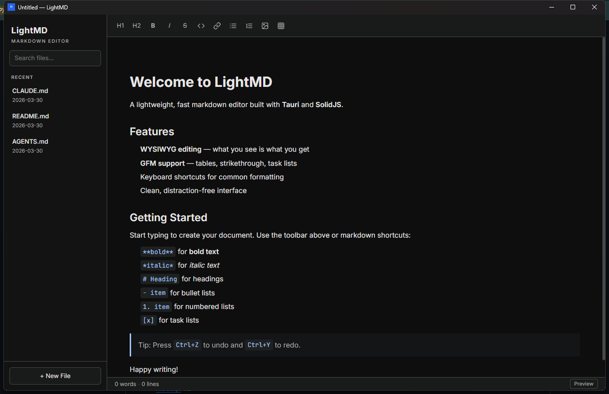

# LightMD

A lightweight, fast markdown editor for Windows. Built with Tauri and SolidJS.



## Why

VS Code is heavy for quick `.md` editing. Typora is paid. Most alternatives are either Electron-bloated or lack WYSIWYG. LightMD is a portable, native-speed markdown editor that starts in under 500ms and ships as a single ~11 MB `.exe`.

## Features

- **Inline WYSIWYG editing** -- Milkdown/ProseMirror engine, edit rendered markdown directly
- **Tiny and fast** -- ~11 MB portable `.exe`, sub-500ms startup, minimal memory footprint
- **Dark theme** -- "Fluent Obsidian" design, easy on the eyes
- **Native file dialogs** -- open, save, save-as via OS-native dialogs
- **Drag and drop** -- drop `.md` files onto the window to open them
- **File association** -- registers `.md` and `.markdown` extensions on Windows
- **Recent files sidebar** -- quick access to recently opened documents
- **Formatting toolbar** -- headings, bold, italic, strikethrough, code, lists, tables, links, images
- **Source mode** -- toggle between WYSIWYG and raw markdown with Ctrl+/
- **Keyboard shortcuts** -- standard editor shortcuts (Ctrl+S, Ctrl+O, Ctrl+N, Ctrl+B, Ctrl+I, etc.)
- **Single instance mode** -- opening a second file focuses the running instance
- **CommonMark + GFM** -- tables, task lists, strikethrough, code blocks
- **Mermaid diagrams** -- live WYSIWYG preview for ` ```mermaid ` blocks with fullscreen, zoom/pan, and clipboard export (SVG/PNG)

## Tech Stack

| Layer    | Technology                        |
| -------- | --------------------------------- |
| Runtime  | Tauri 2 (Rust)                    |
| Frontend | SolidJS 1.9, TypeScript, Vite 6  |
| Editor   | Milkdown 7 (ProseMirror)          |
| Styling  | Tailwind CSS 4                    |
| Backend  | Rust (file I/O, recent files, single instance) |
| Webview  | WebView2 (Windows)                |

## Getting Started

### Prerequisites

- [Node.js](https://nodejs.org/) 18+
- [Rust](https://www.rust-lang.org/tools/install) (stable toolchain)
- [WebView2](https://developer.microsoft.com/en-us/microsoft-edge/webview2/) (pre-installed on Windows 10/11)

### Install

```bash
git clone https://github.com/ak40u/light-md-editor.git
cd light-md-editor
npm install
```

### Development

```bash
npm run tauri dev
```

### Build

```bash
npm run tauri build
```

The installer and portable `.exe` are output to `src-tauri/target/release/bundle/`.

## Keyboard Shortcuts

| Shortcut         | Action              |
| ---------------- | ------------------- |
| `Ctrl + N`       | New file            |
| `Ctrl + O`       | Open file           |
| `Ctrl + S`       | Save file           |
| `Ctrl + B`       | Bold                |
| `Ctrl + I`       | Italic              |
| `Ctrl + E`       | Inline code         |
| `Ctrl + Z`       | Undo                |
| `Ctrl + Shift+Z` | Redo                |
| `Ctrl + /`       | Toggle source mode  |
| `Ctrl + \`       | Toggle sidebar      |

## Architecture

```
+----------------------------------------------------------+
|  LightMD                                                 |
|                                                          |
|  +-------------------+    IPC (invoke)    +------------+ |
|  |   Rust Backend    | <================> |  WebView2  | |
|  |   (Tauri 2)       |                    |            | |
|  |                   |                    |  SolidJS   | |
|  |  - File I/O       |    Events          |  Milkdown  | |
|  |  - Recent files   | =================> |  Tailwind  | |
|  |  - Single instance|  (open-file, etc.) |            | |
|  |  - CLI args        |                    |            | |
|  |  - Drag & drop     |                    |            | |
|  +-------------------+                    +------------+ |
+----------------------------------------------------------+
```

The Rust backend handles all filesystem operations and OS integration. The SolidJS frontend renders the UI and the Milkdown editor. Communication happens through Tauri's IPC (`invoke` for commands, `emit`/`listen` for events).

## License

[MIT](LICENSE)
